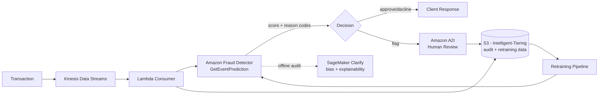
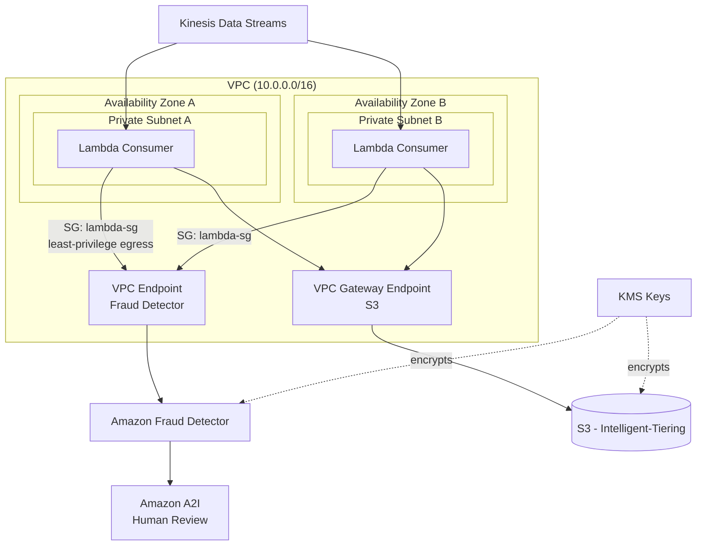

# Solution: Fraud Detection on AWS

> Concrete implementation of `../../cases/fraud-detection.md` using AWS services.
> Related design: `../../cases/fraud-detection.md`

**Status:** In Progress
**Date:** 2026-09

---

## 1. Requirements
**Functional:**
- Score every transaction in real time (approve / decline / flag for review)
- Support rule-based overrides alongside ML scoring
- Provide explainability for flagged transactions (regulatory requirement)
- Allow human analysts to review and label flagged cases (feedback loop)

**Non-functional:**
- Latency: <100–300ms per decision (transaction can't hang)
- Availability: 99.99%+ (system going down blocks all payments)
- Throughput: 50M/day ≈ ~580 TPS average; design for 5–10x peak (Black Friday, lunch hour) → ~2,900–5,800 TPS peak
- Consistency: eventual consistency fine for model updates; the transaction decision itself must be strongly consistent (no double-approval)

## 2. Constraints
- Class imbalance: fraud is ~0.1–0.5% of transactions — accuracy is a useless metric
- Cost asymmetry: false negative (missed fraud) vs. false positive (blocked legit purchase) have very different business costs
- Adversarial environment: fraudsters adapt to the model, so it decays faster than typical ML systems
- Regulatory: decisions often need to be explainable, not just a model score

## 3. Capacity Estimation
- Average throughput: 50M/day ÷ 86,400s ≈ **580 TPS**
- Peak (5–10x): **~2,900–5,800 TPS**
- **Critical constraint:** Amazon Fraud Detector's `GetEventPrediction` API has a default quota of **200 TPS per account** (adjustable via AWS Support request). Average load already exceeds default quota by ~3x, and peak exceeds it by up to ~29x. A quota increase must be requested well ahead of launch, with a documented fallback (see Failure Scenarios) for bursts that still exceed the approved quota.
- Storage: ~50M records/day × ~2KB (transaction + features + score) ≈ ~100GB/day raw → S3 with Intelligent-Tiering for cost-efficient retention of score history and client transaction history.
- Kinesis: On-Demand mode auto-scales; in Provisioned mode, plan shard count off record throughput (1,000 records/sec/shard) — at peak that's a minimum of ~6 shards, more if record size pushes the 1MB/s/shard data cap first.

## 4. High-Level Architecture

**Functional requirements → AWS mapping:**
- **Real-time scoring:** Kinesis Data Streams ingests each transaction → a Lambda consumer calls Amazon Fraud Detector's `GetEventPrediction` API, which combines a fraud ML model with configurable business rules in one call
- **Explainability:** Fraud Detector returns model reason codes per prediction; SageMaker Clarify is used offline to audit the model for bias and produce feature-importance reports for compliance
- **Human review:** flagged transactions route to **Amazon A2I (Augmented AI)**, which provides the review/labeling workflow itself — Clarify has no review UI, so it's the wrong tool for this step
- **Rule-based overrides:** defined natively as Fraud Detector rules alongside the ML score, rather than a separate rules table — fewer moving parts unless the rule logic outgrows Fraud Detector's rule language

**Non-functional requirements → AWS mapping:**
- **Latency (<300ms):** Kinesis + synchronous Lambda → Fraud Detector call keeps the whole path sub-second, pending load testing against the quota-adjusted TPS
- **Availability (99.99%+):** Lambda and Fraud Detector are both managed with built-in HA; if a custom scoring model is added later on ECS/EKS, autoscaling + multi-AZ covers that layer
- **Throughput (peak ~5,800 TPS):** Kinesis Enhanced Fan-Out gives each consumer a dedicated 2MB/s/shard pipe instead of sharing it — needed once multiple consumers read the same stream (e.g. scoring Lambda + an audit-logging consumer)

### Scoring model decision

**Reflection:** should Fraud Detector be the sole scorer, or should a custom SageMaker/XGBoost model run alongside it?

**Resolved:** Fraud Detector is the sole scorer. It already handles class imbalance internally during training and returns a model score, rule evaluation, and flagging decision in a single call — a separate SageMaker pipeline isn't needed for the MVP. This gets revisited only if a specific gap emerges that Fraud Detector can't close (see section 15, Evolution).

### Architecture Diagram (Mermaid)

## 5. Data Flow
1. Transaction hits Kinesis Data Streams
2. Lambda consumer picks up the record, calls Fraud Detector `GetEventPrediction` (model score + rule evaluation + reason codes in one response)
3. Decision (approve / decline / flag) returned synchronously within the latency budget
4. Full record (transaction + score + reason codes) written to S3 (partitioned by date) for audit and future retraining
5. Flagged transactions additionally routed to Amazon A2I for human review; reviewer labels feed back into retraining data

## 6. API / Interfaces
- Kinesis has no native external-API integration — the Lambda consumer is a required bridge to Fraud Detector, not an optional fallback
- `GetEventPrediction` payload limit is 256KB, max 5,000 inputs per call — irrelevant at single-transaction granularity, but relevant if batching is ever considered

## 7. Storage
- **S3 (Intelligent-Tiering):** raw transaction + score + reason-code records, partitioned by date, for audit trail and retraining datasets
- **DynamoDB (if needed):** low-latency lookups for customer risk profiles or velocity checks not covered by Fraud Detector's own aggregated variables

## 8. Scaling
- Kinesis On-Demand (or Provisioned with Enhanced Fan-Out) absorbs traffic spikes
- Fraud Detector quota increase requested proactively, sized to peak TPS with headroom
- If a custom model is added on ECS/EKS, standard autoscaling on CPU/request count

## 9. Reliability
- Multi-AZ by default (Kinesis, Lambda, Fraud Detector are all regional managed services)
- Dead-letter queue on the Lambda consumer so failed records aren't silently dropped

## 10. Security
- IAM roles scoped per resource (least privilege), no shared credentials between components
- KMS encryption at rest (S3, DynamoDB) and for Fraud Detector's stored data
- VPC endpoints for Fraud Detector/Kinesis calls to avoid public internet exposure where possible

## 11. Observability
- CloudWatch metrics/alarms on: Lambda error rate and duration, Fraud Detector throttling (429s against the 200 TPS quota), Kinesis iterator age (a proxy for consumer lag)
- Dedicated alarm on Fraud Detector throttle rate — the most likely early failure point given the quota gap identified above

## 12. Cost
- Budget alerts per service; Fraud Detector and Kinesis are usage-based (per-prediction, per-shard-hour), so cost scales with the same TPS figures used for capacity planning
- First month run at reduced/experimental scale to validate real per-transaction cost before committing to the full quota increase

## 13. Trade-offs
- **Fraud Detector vs. a fully custom SageMaker model:** managed simplicity, built-in rules + explainability, faster time-to-production — vs. less control over feature engineering and algorithm choice. A custom model stays an option if Fraud Detector's accuracy plateaus, but it isn't the starting point.
- **Synchronous Lambda bridge vs. an async queue-based scoring path:** synchronous keeps the <300ms requirement simple to reason about, but ties transaction latency directly to Fraud Detector's response time and throttle behavior; async would be more resilient to bursts but complicates the "decide in real time" functional requirement.

## 14. Failure Scenarios
- **Fraud Detector throttles above the approved TPS quota:** fail open to a rules-only decision (e.g. decline above a configured risk threshold) and queue the transaction for async re-scoring once capacity frees up — never silently auto-approve on throttle.
- **Lambda bridge times out or errors:** default to decline-and-queue-for-review rather than silent approval — a false decline is cheaper than an undetected fraud loss.
- **Kinesis consumer falls behind (rising iterator age):** scale out via Enhanced Fan-Out; alert before iterator age approaches the stream's retention window, or data is lost.

---

## Appendix: Deployment & Network Topology (practice)

> Not part of the standard 15-section template — kept as an unnumbered appendix so other case/solution docs aren't expected to include it. Complements the reasoning already in sections 8–10 (Scaling, Reliability, Security) with a visual of where things actually sit.

### Architecture Diagram as Mermaid format

## Architecture Diagram as Draw.io format

[Fraud detection architecture on AWS - file](https://github.com/gil-son/system-design-ai/tree/main/03-agentic-system-design/diagrams/01-ml-system-design/complete_fraud_detection_solution.drawio)

**What this adds over the section 4 diagram:** AZ redundancy (two private subnets, no single point of failure), VPC endpoints keeping Fraud Detector and S3 traffic off the public internet, and where KMS encryption applies — the concrete answer to "how would you isolate this from the public internet?" if asked live.

---

## 15. Evolution / Future Improvements
- Add a custom SageMaker model once there's a specific gap Fraud Detector can't close (e.g. a fraud pattern needing proprietary features), rather than duplicating it from day one
- Introduce scheduled fine-tuning/retraining cycles as labeled review data from A2I accumulates
- Consider graph-based fraud detection (e.g. Amazon Neptune) for fraud-ring detection across linked accounts, as a v2 capability beyond single-transaction scoring
